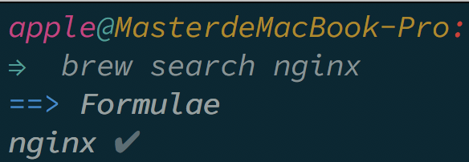

### Nginx的安装

https://nginx.org

Mac可以使用brew来安装nginx

```shell

    brew search // 查看brew上具有的所有包的列表

    brew search xxx|nginx // 搜索具体的某个包

    brew install nginx

    brew info nginx // 查看nginx的文件位置

```



#### 启动nginx

在上面的图片中可以看到nginx被安装到了/usr/local/Cellar/nginx/1.15.3/
默认的配置文件在/usr/local/etc/nginx/nginx.conf

```shell

    /usr/local/Cellar/nginx/1.15.3/ -c /usr/local/etc/nginx/nginx.conf
    // 启动nginx

    /usr/local/Cellar/nginx/1.15.3/ -t -c /usr/local/etc/nginx/nginx.conf
    // 测试配置文件是否正确

```

如果启动成功的话访问localhost:8080可以看到
// 带插入图片

nginx会以守护进程的方式启动服务
```shell
    ps -ef|grep nginx // 查看进程ID

    kill pid // 直接杀死进程ID

    ---

    nginx -s stop // 停止nginx
```


